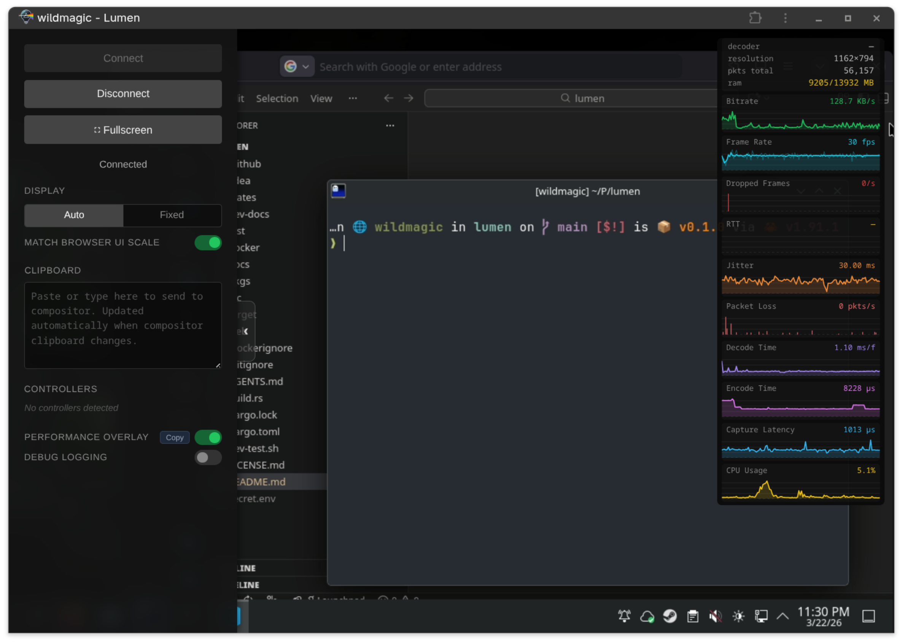

<p align="center">
    
<p>

**Lumen** is a Wayland compositor that streams your Linux desktop to a web browser over WebRTC — no client software required.

> [!WARNING]
> This project is currently experimental and not yet stable. Use at your own risk! Please report any problems you encounter.

<p align="center">
    
<p>

## Purpose & Goals

Lumen exists to replace legacy Linux remote desktop solutions (VNC, RDP, NX, and similar) for the Wayland era. The goal is to provide a high-performance, low-latency desktop streaming experience accessible from any modern browser, with no plugins or native clients needed on the viewer side.

Supports desktop and mobile browsers, including ChromeOS, Android and iOS. Connect
from wherever you are.

## Why another Remote Desktop Solution?

There are countless other solutions to this problem, so why another?
 * Many applications don't work (well) with Wayland making them difficult to configure
   and use on bleeding edge Linux distributions.
 * Most require client side software making it difficult or inconsistent to use
   if you use multiple types of devices or operating systems.
 * Hardware acceleration support is inconsistent, they either rely entirely on
   software rendering or specific encoding hardware making them difficult to use
   or slow for realtime applications.

## Key Features

- **Wayland-Native**: Built on [Smithay](https://github.com/Smithay/smithay) — modern, secure window management and frame capture.
- **WebRTC Streaming**: Low-latency H.264 video and Opus audio delivered directly to any modern browser via the [str0m](https://github.com/algesten/str0m) WebRTC stack.
- **Hardware Acceleration**: VA-API (Intel/AMD) zero-copy H.264 encoding with automatic x264 software fallback (experimental NVENC support exists).
- **System Audio**: PipeWire capture encoded to Opus.
- **Interactive Input**: Keyboard, mouse, and clipboard forwarded from the browser back into the Wayland session.
- **Embedded TURN Server**: Built-in TURN relay so the stream works across NAT without an external relay.
- **Authentication**: Optional auth modes — HTTP Basic (PAM), bearer token, or OAuth2/OIDC.
- **TLS**: Native HTTPS/WSS support via PEM certificate and key.
- **Single Binary**: Built-in web server and signaling — just run `lumen` and open a browser.

## Project Structure

Lumen is organized as a Rust workspace with several specialized crates:

- **`lumen-compositor`**: The core Wayland compositor logic using Smithay. Handles window management, rendering, and frame capture.
- **`lumen-webrtc`**: Manages WebRTC sessions, ICE negotiation (via str0m), and RTP packetization for H.264 and Opus.
- **`lumen-encode`**: Video encoding abstraction layer. Supports VA-API and software (x264) backends.
- **`lumen-audio`**: Captures system audio from PulseAudio monitor sources and encodes it using Opus.
- **`lumen-web`**: An Axum-based web server that serves the frontend client and handles WebSocket signaling.
- **`lumen-turn`**: Embedded TURN/STUN relay server so WebRTC peers behind NAT can exchange media without an external relay.
- **`lumen-gamepad`**: Virtual gamepad devices via `uinput` — browser-connected gamepads appear as standard `/dev/input` devices to applications.
- **`web/`**: The frontend browser client built with vanilla JavaScript and Web APIs.

## Installation

### From a package (.deb / .rpm)

The recommended way to install Lumen on a system is via a native package. Packages are built using Docker — no build dependencies required on the host.

```bash
# Build packages
docker build -f docker/Dockerfile.packages -t lumen-packages .
mkdir -p dist
docker run --rm -v ./dist:/output lumen-packages
```

Then install the package for your distribution:

```bash
# Ubuntu / Debian
sudo apt install ./dist/lumen_*.deb

# Fedora / RHEL
sudo dnf install ./dist/lumen-*.rpm
```

After installation, create a config file and start the service:

```bash
sudo cp /etc/lumen/example.env /etc/lumen/<username>.env
sudo nano /etc/lumen/<username>.env   # set LUMEN_LAUNCH, auth, etc.
sudo systemctl start lumen@<username>
```

See [`pkgs/README.md`](pkgs/README.md) for the full build, configuration, and service management guide.

### From Docker

A Docker image is also available that bundles a full desktop (labwc + Firefox). See [`docker/README.md`](docker/README.md).

---

## Building from Source

### Prerequisites

- Rust (latest stable)
- PulseAudio / PipeWire (with PulseAudio compatibility)
- VA-API compatible drivers (optional, for hardware acceleration)
- `libx264`, `libva`, `libopus` development headers

### Build

```bash
cargo build --release
```

### Run

You can run Lumen with default settings:

```bash
cargo run --release
```

Then, open your browser and navigate to `http://localhost:8080`.

### Configuration

All options can be set via command-line flags or environment variables.

#### Core

| Flag | Env | Default | Description |
|------|-----|---------|-------------|
| `--bind-addr` | `LUMEN_BIND` | `0.0.0.0:8080` | Address to bind the web server to |
| `--width` | `LUMEN_WIDTH` | `1920` | Output width in pixels |
| `--height` | `LUMEN_HEIGHT` | `1080` | Output height in pixels |
| `--fps` | `LUMEN_FPS` | `30.0` | Target frames per second |
| `--video-bitrate-kbps` | `LUMEN_VIDEO_BITRATE_KBPS` | `4000` | Target video bitrate (kbps) |
| `--max-bitrate-kbps` | `LUMEN_MAX_BITRATE_KBPS` | `2× video-bitrate` | Peak VBR bitrate cap (kbps) |
| `--audio-bitrate-bps` | `LUMEN_AUDIO_BITRATE_BPS` | `128000` | Opus audio bitrate (bps) |
| `--audio-device` | `LUMEN_AUDIO_DEVICE` | *(auto: monitor)* | PulseAudio device name to capture |
| `--dri-node` | `LUMEN_DRI_NODE` | *(auto-detected)* | DRI render node for VA-API (e.g. `/dev/dri/renderD128`) |
| `--inner-display` | `LUMEN_INNER_DISPLAY` | `auto` | Wayland socket of a nested compositor to bridge clipboard from; set to `""` to disable |
| `--ice-servers` | `LUMEN_ICE_SERVERS` | `stun:stun.l.google.com:19302` | Comma-separated ICE/STUN server URLs |
| `--static-dir` | `LUMEN_STATIC_DIR` | `./web` | Directory to serve the browser client from |
| `--launch` | `LUMEN_LAUNCH` | | Shell command to launch as a Wayland client once the compositor is ready (e.g. `labwc`, `sway`) |

#### TURN Server

Lumen includes an embedded TURN server to relay WebRTC traffic across NAT. It is enabled by default on port 3478.

| Flag | Env | Default | Description |
|------|-----|---------|-------------|
| `--turn-port` | `LUMEN_TURN_PORT` | `3478` | UDP port for the TURN server (set to `0` to disable) |
| `--turn-external-ip` | `LUMEN_TURN_EXTERNAL_IP` | *(auto-detected)* | Public IP to advertise as the TURN relay address |
| `--turn-username` | `LUMEN_TURN_USERNAME` | `lumen` | TURN username |
| `--turn-password` | `LUMEN_TURN_PASSWORD` | `lumenpass` | TURN password |
| `--turn-min-port` | `LUMEN_TURN_MIN_PORT` | `50000` | Low end of UDP relay port range |
| `--turn-max-port` | `LUMEN_TURN_MAX_PORT` | `50010` | High end of UDP relay port range |

#### Authentication

| Flag | Env | Default | Description |
|------|-----|---------|-------------|
| `--auth` | `LUMEN_AUTH` | `none` | Auth mode: `none`, `basic` (PAM), `bearer`, or `oauth2` (OIDC) |
| `--auth-bearer-token` | `LUMEN_AUTH_BEARER_TOKEN` | | `[bearer]` Preshared token; clients must send `Authorization: Bearer <token>` |
| `--auth-oauth2-issuer-url` | `LUMEN_AUTH_OAUTH2_ISSUER_URL` | | `[oauth2]` OIDC issuer URL (discovery fetched from `/.well-known/openid-configuration`) |
| `--auth-oauth2-client-id` | `LUMEN_AUTH_OAUTH2_CLIENT_ID` | | `[oauth2]` OAuth2 client ID |
| `--auth-oauth2-client-secret` | `LUMEN_AUTH_OAUTH2_CLIENT_SECRET` | | `[oauth2]` OAuth2 client secret |
| `--auth-oauth2-redirect-uri` | `LUMEN_AUTH_OAUTH2_REDIRECT_URI` | | `[oauth2]` Full redirect URI (e.g. `http://localhost:8080/auth/callback`) |
| `--auth-oauth2-subject` | `LUMEN_AUTH_OAUTH2_SUBJECT` | | `[oauth2]` Expected `sub` claim; access denied if it doesn't match |

#### TLS

| Flag | Env | Description |
|------|-----|-------------|
| `--tls-cert` | `LUMEN_TLS_CERT` | Path to a PEM TLS certificate chain; enables HTTPS when paired with `--tls-key` |
| `--tls-key` | `LUMEN_TLS_KEY` | Path to a PEM TLS private key; must be provided together with `--tls-cert` |

## Architecture

1.  **Compositor**: Renders the desktop/applications. Frames are captured and sent to the Encoder.
2.  **Audio**: Captures audio samples from PulseAudio and encodes them into Opus packets.
3.  **Encoder**: Takes raw frames and produces H.264 bitstream (using VA-API if available).
4.  **Signaling**: The browser connects to the Web Server via WebSocket to exchange SDP offers/answers and ICE candidates.
5.  **WebRTC**: Once the connection is established, H.264 and Opus packets are sent over SRTP. Input events are sent back from the browser via WebRTC Data Channels.
6.  **Input**: The Compositor receives input events and injects them into the virtual keyboard/pointer devices.

The architecture for this application was heavily inspired by the excellent 
[Selkies](https://github.com/selkies-project/selkies) and [Pixelflux](https://github.com/linuxserver/pixelflux) projects.