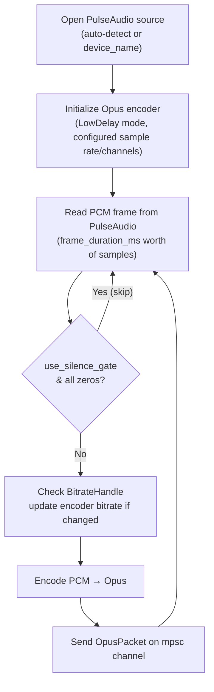

# lumen-audio

**Crate**: `crates/lumen-audio`

`lumen-audio` captures system audio from a PulseAudio monitor source and encodes it to Opus packets for delivery over WebRTC.

## Responsibilities

- Connect to a PulseAudio source (monitor or explicit device)
- Read raw PCM audio samples in a tight blocking loop
- Optionally skip silent frames to reduce bandwidth
- Encode PCM frames to Opus bitstream
- Support runtime bitrate adjustment without stopping the encoder
- Deliver encoded `OpusPacket`s via an `mpsc` channel

## Public API

### `AudioCapture`

```rust
pub struct AudioCapture { ... }

impl AudioCapture {
    pub fn new(config: AudioConfig) -> Result<(Self, mpsc::Receiver<OpusPacket>)>;
    pub fn run(&mut self) -> Result<()>;  // Blocking; call from spawn_blocking
}
```

`new()` returns both the `AudioCapture` and the receiving end of the packet channel. The caller passes the receiver to whichever task fans audio packets out to WebRTC sessions.

### `AudioConfig`

```rust
pub struct AudioConfig {
    pub device_name: Option<String>,  // None = auto-detect default monitor source
    pub sample_rate: u32,             // Default: 48000 Hz
    pub channels: u8,                 // 1 = mono, 2 = stereo (default: 2)
    pub bitrate_bps: i32,             // Default: 128_000 bps
    pub frame_duration_ms: u32,       // Opus frame size in ms (default: 20)
    pub use_vbr: bool,                // Variable bitrate (default: false)
    pub use_silence_gate: bool,       // Skip silent frames (default: false)
    pub peer_count: Option<Arc<AtomicUsize>>,  // Active peer count; when Some and zero, encoding is skipped (PCM still drained); None = always encode (default)
}
```

### `OpusPacket`

```rust
pub struct OpusPacket {
    pub data: Bytes,         // Encoded Opus bitstream
    pub pts_samples: u64,    // Presentation timestamp in samples at the configured sample rate
}
```

### `BitrateHandle`

A cheap, cloneable handle for updating the encoder bitrate at runtime without restarting the capture loop.

```rust
pub struct BitrateHandle { ... }  // Clone

impl BitrateHandle {
    pub fn set(&self, bps: i32);
}
```

Internally backed by an `Arc<AtomicI32>` so updates are lock-free and visible to the encoding loop on the next frame.

## Capture Loop



## Design Notes

- **Opus LowDelay mode**: The encoder is initialized with the `LowDelay` application type, minimizing algorithmic latency at the cost of slightly lower quality at low bitrates. This is appropriate for real-time streaming.
- **20 ms frames**: The default frame duration matches the standard WebRTC Opus RTP packetization interval.
- **Silence gating**: When enabled, frames where all PCM samples are zero (complete silence) are dropped before encoding. This saves CPU and bandwidth during quiet periods. The WebRTC receiver handles gaps gracefully via comfort noise generation.
- **Lock-free bitrate updates**: The `AtomicI32` in `BitrateHandle` lets the web layer or a future bandwidth estimator update the audio bitrate without any mutex contention.
- **PulseAudio monitor source**: By default, Lumen captures from the monitor source of the default PulseAudio sink, which captures all system audio output (the "what you hear" input).
