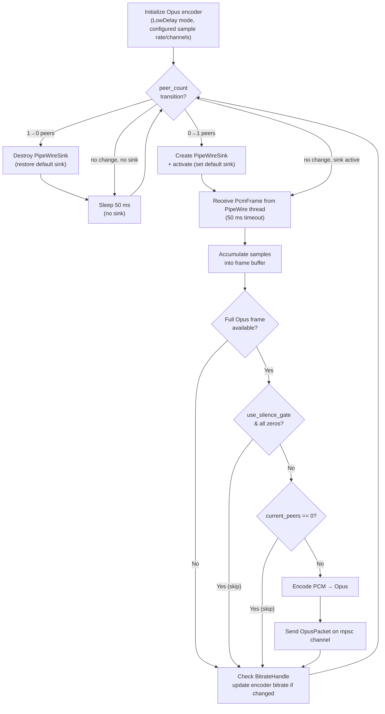

# lumen-audio

**Crate**: `crates/lumen-audio`

`lumen-audio` creates a virtual PipeWire audio sink that appears as a system audio output device. Applications route audio to this sink; the crate captures the incoming PCM stream directly, encodes it to Opus packets, and delivers them via a Tokio channel.

## Responsibilities

- Create a native PipeWire virtual sink (`Audio/Sink`) called `lumen_capture`
- Manage the sink lifecycle lazily: created on first peer connect, destroyed on last disconnect
- Switch the system default audio output to `lumen_capture` on activation and restore the original on deactivation
- Read raw F32LE PCM audio from the virtual sink on a dedicated PipeWire thread
- Optionally skip silent frames to reduce bandwidth
- Encode PCM frames to Opus bitstream
- Support runtime bitrate adjustment without stopping the encoder
- Deliver encoded `OpusPacket`s via an `mpsc` channel

## Public API

### `AudioCapture`

```rust
pub struct AudioCapture { ... }

impl AudioCapture {
    pub fn new(config: AudioConfig) -> Result<(Self, mpsc::Receiver<OpusPacket>)>;
    pub fn bitrate_handle(&self) -> BitrateHandle;
    pub fn stop(&self);
    pub fn run(&mut self) -> Result<()>;  // Blocking; call from spawn_blocking
}
```

`new()` returns both the `AudioCapture` and the receiving end of the packet channel. The caller passes the receiver to whichever task fans audio packets out to WebRTC sessions.

`stop()` signals the capture loop to exit cleanly on the next iteration.

### `AudioConfig`

```rust
pub struct AudioConfig {
    pub sample_rate: u32,             // Default: 48000 Hz
    pub channels: u8,                 // 1 = mono, 2 = stereo (default: 2)
    pub bitrate_bps: i32,             // Default: 128_000 bps
    pub frame_duration_ms: u32,       // Opus frame size in ms (default: 20)
    pub use_vbr: bool,                // Variable bitrate (default: false)
    pub use_silence_gate: bool,       // Skip silent frames (default: false)
    pub peer_count: Option<Arc<AtomicUsize>>,  // Active peer count; when Some and zero, encoding is skipped (PCM still drained); None = always encode (default)
}
```

### `OpusPacket`

```rust
pub struct OpusPacket {
    pub data: Bytes,         // Encoded Opus bitstream
    pub pts_samples: u64,    // Presentation timestamp in samples at the configured sample rate
}
```

### `BitrateHandle`

A cheap, cloneable handle for updating the encoder bitrate at runtime without restarting the capture loop.

```rust
pub struct BitrateHandle { ... }  // Clone

impl BitrateHandle {
    pub fn set(&self, bps: i32);
}
```

Internally backed by an `Arc<AtomicI32>` so updates are lock-free and visible to the encoding loop on the next frame.

## Architecture

The crate has two layers:

- **`PipeWireSink`** (`pw_sink.rs`) — owns a dedicated `lumen-pipewire` OS thread running a PipeWire main loop. The thread creates an `Audio/Sink` stream and uses the PipeWire metadata API to manage the `default.audio.sink` property. PCM frames from the process callback are forwarded to the capture layer via a `std::sync::mpsc` channel. A `pw::channel` carries control messages (`Activate`, `Deactivate`, `Stop`) back into the PipeWire loop.

- **`AudioCapture`** (`capture.rs`) — blocking loop that drives the lazy sink lifecycle, accumulates PCM frames into Opus-sized chunks, and encodes them.

## Capture Loop



## Design Notes

- **Virtual sink, not a monitor**: Lumen creates a native `Audio/Sink` in the PipeWire graph. Users (or WirePlumber rules) route audio to `lumen_capture`; the sink receives audio directly rather than monitoring another sink's output.
- **Default-sink management**: On first peer connect, `lumen_capture` is set as the `default.audio.sink` via the PipeWire metadata API; the previous default is captured and restored on last disconnect.
- **Lazy sink lifecycle**: The PipeWire sink is created only when the first peer connects and destroyed when the last peer disconnects. This avoids registering the sink in the PipeWire graph during system startup (before WirePlumber and `kwin_wayland` are fully initialized), which previously caused intermittent KDE startup failures.
- **Dedicated PipeWire thread**: All PipeWire API calls run on the `lumen-pipewire` OS thread. PCM frames cross into the capture loop via a `std::sync::mpsc::SyncSender`; control messages flow back via a `pw::channel`.
- **Opus LowDelay mode**: The encoder is initialized with the `LowDelay` application type, minimizing algorithmic latency at the cost of slightly lower quality at low bitrates. This is appropriate for real-time streaming.
- **20 ms frames**: The default frame duration matches the standard WebRTC Opus RTP packetization interval. PipeWire delivers audio at its own quantum size; the capture loop accumulates samples into a buffer and encodes a frame only when a full Opus frame worth of samples is available.
- **Silence gating**: When enabled, frames where all PCM samples are zero (complete silence) are dropped before encoding. This saves CPU and bandwidth during quiet periods.
- **Lock-free bitrate updates**: The `AtomicI32` in `BitrateHandle` lets the web layer or a future bandwidth estimator update the audio bitrate without any mutex contention.
