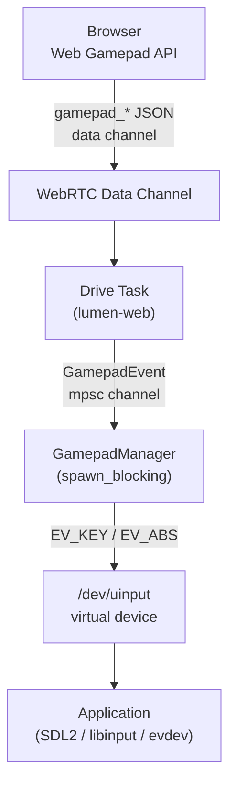

# lumen-gamepad

**Crate**: `crates/lumen-gamepad`

`lumen-gamepad` translates browser Web Gamepad API events into Linux `uinput` input events, creating virtual gamepad devices that applications (SDL2, libinput, raw evdev) see as ordinary `/dev/input/eventXXX` devices — no `LD_PRELOAD` magic required.

## Responsibilities

- Create virtual gamepad devices via `/dev/uinput` on demand
- Map Web Gamepad API button/axis indices to Linux evdev event codes
- Emit `EV_KEY` (buttons) and `EV_ABS` (axes) events to the virtual devices
- Track up to [`MAX_GAMEPADS`] simultaneously connected gamepads
- Destroy virtual devices when gamepads disconnect

## Prerequisites

The process must have write access to `/dev/uinput`. On most systems this requires membership of the `input` group or a udev rule:

```text
KERNEL=="uinput", MODE="0660", GROUP="input"
```

If `/dev/uinput` is inaccessible, the first `GamepadEvent::Connected` event will fail with `GamepadError::UinputOpen`. The caller should log a warning and continue — lumen runs fine without gamepad support.

## Public API

### `GamepadManager`

```rust
pub struct GamepadManager { ... }  // !Send — run inside spawn_blocking

impl GamepadManager {
    pub fn new() -> Self;

    /// Process a single gamepad event, creating or updating virtual devices
    /// as needed. Non-fatal errors are logged as warnings and dropped.
    pub fn handle_event(&mut self, event: GamepadEvent);
}
```

### `GamepadEvent`

Events produced by the browser's Web Gamepad API and forwarded via the WebRTC data channel:

```rust
pub enum GamepadEvent {
    Connected {
        index: u8,        // Gamepad slot (0–3)
        name: String,     // Human-readable name from the browser
        num_axes: u8,     // Number of axes reported by the browser
        num_buttons: u8,  // Number of buttons reported by the browser
    },
    Disconnected {
        index: u8,
    },
    Button {
        index: u8,    // Gamepad slot
        button: u8,   // Web Gamepad button index (0–16 standard layout)
        value: f32,   // Analog value 0.0–1.0
        pressed: bool,
    },
    Axis {
        index: u8,   // Gamepad slot
        axis: u8,    // Web Gamepad axis index (0–3 standard layout)
        value: f32,  // Normalized −1.0 to 1.0
    },
}
```

### Constants and Errors

```rust
pub const MAX_GAMEPADS: u8 = 4;

pub enum GamepadError {
    UinputOpen(io::Error),      // /dev/uinput could not be opened
    DeviceSetup(io::Error),     // uinput ioctl failed during device creation
    Emit(io::Error),            // Failed to write an input event
    IndexOutOfRange(u8),        // index >= MAX_GAMEPADS
    NotConnected(u8),           // Button/axis event for a disconnected slot
    AlreadyConnected(u8),       // Connected event for an already-open slot (treated as reconnect)
}
```

## Event Flow



## Design Notes

- **`!Send`**: `GamepadManager` holds `evdev::uinput::VirtualDevice` handles which are not `Send`. It must run inside `tokio::task::spawn_blocking` on a dedicated thread.
- **On-demand device creation**: Devices are only opened when `GamepadEvent::Connected` is received. If `uinput` is unavailable, the failure is confined to that one event; the rest of lumen is unaffected.
- **Reconnect handling**: If a `Connected` event arrives for a slot that already has a device (e.g. the browser re-sends the event), the old device is replaced with a fresh one.
- **Axis scaling**: Web Gamepad axis values (−1.0 to 1.0) are scaled to the Linux `ABS_*` range (−32767 to 32767) before emission.
