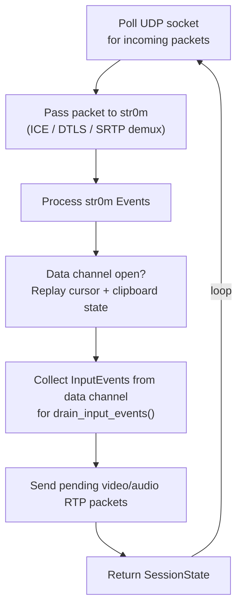

# lumen-webrtc

**Crate**: `crates/lumen-webrtc`

`lumen-webrtc` manages WebRTC peer sessions: SDP negotiation, ICE connectivity, SRTP media delivery, and bidirectional data channel communication.

## Responsibilities

- Accept SDP offers from browsers and produce SDP answers
- Perform ICE candidate gathering and connectivity checks
- Deliver H.264 video and Opus audio over SRTP/RTP
- Receive input events from browsers via WebRTC data channels
- Manage multiple concurrent peer sessions
- Expose peer count for encoder optimization

## Public API

### `SessionManager`

A cheaply cloneable (`Arc` internally) manager for all active peer sessions.

```rust
pub struct SessionManager { ... }  // Clone (Arc)

impl SessionManager {
    pub fn new(config: SessionConfig) -> Arc<Self>;

    // Create a new session from an SDP offer; returns (session_id, answer_sdp)
    pub async fn create_session(&self, offer_sdp: &str) -> Result<(SessionId, String)>;

    pub async fn get_session(&self, id: &SessionId) -> Option<Arc<Mutex<WebRtcSession>>>;

    // Remove a session by ID, decrementing the peer count. Called by the
    // per-session drive task in lumen-web when drive() returns SessionState::Closed.
    pub async fn remove_session(&self, id: &SessionId);

    pub async fn all_sessions(&self) -> Vec<Arc<Mutex<WebRtcSession>>>;

    // Send a data channel message to all connected peers
    pub async fn broadcast_dc_message(&self, data: Vec<u8>);

    // Lock-free peer count for encoder optimization
    pub fn peer_count(&self) -> Arc<AtomicUsize>;
}
```

### `WebRtcSession`

Represents a single browser peer connection. Constructed by `SessionManager::create_session()`.

```rust
pub struct WebRtcSession { ... }

impl WebRtcSession {
    pub async fn new(config: SessionConfig, offer_sdp: &str) -> Result<(Self, String)>;

    // Push media to this peer
    pub fn push_video(&mut self, frame: &EncodedFrame) -> Result<()>;
    pub fn push_audio(&mut self, packet: &OpusPacket) -> Result<()>;

    // Send a data channel message to this peer
    pub fn push_dc_message(&mut self, data: Vec<u8>);

    // Drain queued input events received from the browser
    pub fn drain_input_events(&mut self) -> Vec<InputEvent>;

    // Add a trickle ICE candidate from the browser
    pub fn add_remote_candidate(&mut self, candidate_str: &str) -> Result<()>;

    // Main drive loop; must be called frequently
    pub async fn drive(&mut self) -> Result<SessionState>;

    pub fn is_dc_open(&self) -> bool;
}
```

### `SessionId`

```rust
pub struct SessionId(pub String);

impl SessionId {
    pub fn new() -> Self;  // Generates a UUID v4 string
}
```

### `SessionConfig`

```rust
pub struct SessionConfig {
    pub bind_addr: SocketAddr,           // UDP socket bind address for ICE/media
    pub turn: Option<TurnClientConfig>,  // Optional embedded TURN client
}
```

### `TurnClientConfig`

Configuration for connecting to the embedded TURN server as a client. When present, each session allocates a relay address on the TURN server so browsers behind NAT can reach lumen's media endpoint.

```rust
pub struct TurnClientConfig {
    pub server_addr: SocketAddr,  // TURN server address (e.g. 127.0.0.1:3478)
    pub username: String,
    pub password: String,
    pub relay_ip: IpAddr,         // External IP advertised by the TURN server
}
```

## Internal Implementation

### str0m Integration

Each `WebRtcSession` wraps a `str0m::Rtc` instance and a non-blocking UDP socket. `str0m` is a pure-Rust WebRTC stack that handles:

- SDP offer/answer parsing and generation
- ICE agent (STUN/TURN connectivity checks, candidate gathering)
- DTLS handshake
- SRTP key derivation and media encryption/decryption
- RTP packetization and sequence numbering

### Session Drive Loop

The `drive()` method is the session's heartbeat. It must be called in a tight loop (typically every few milliseconds) to keep the WebRTC state machine progressing.



### RTP Media Delivery

**Video (H.264, RFC 6184)**:

- Receives `EncodedFrame` with Annex-B H.264 data
- Converts PTS from milliseconds to 90 kHz RTP clock
- str0m packetizes NAL units into RTP packets and fragments large NALs per RFC 6184

**Audio (Opus, RFC 7587)**:

- Receives `OpusPacket` with encoded Opus bitstream
- `pts_samples` used directly as the RTP timestamp (48 kHz clock)
- Each Opus packet becomes one RTP packet

### ICE Candidate Gathering

On session creation, str0m gathers:

- **Loopback candidates** (`127.0.0.1`) — for same-machine connections
- **LAN candidates** — detected from local network interfaces

Trickle ICE candidates received from the browser via WebSocket are forwarded to the session via `add_remote_candidate()`.

### Data Channel Messages

The data channel (named `"input"`) carries JSON messages in both directions.

**Browser → Server** (input events):

```json
{ "type": "keyboard_key",    "scancode": 30, "state": 1 }
{ "type": "pointer_motion",  "x": 640.0, "y": 400.0 }
{ "type": "pointer_button",  "btn": 272, "state": 1 }
{ "type": "pointer_axis",    "x": 0.0, "y": -3.0 }
{ "type": "clipboard_write", "text": "Hello, compositor!" }
```

**Server → Browser** (cursor and clipboard):

```json
{ "type": "cursor_update",    "kind": "image", "width": 24, "height": 24,
  "hotspot_x": 0, "hotspot_y": 0, "data": "<base64 RGBA>" }
{ "type": "cursor_update",    "kind": "default" }
{ "type": "cursor_update",    "kind": "hidden" }
{ "type": "clipboard_update", "text": "Hello, world!" }
```

## Design Notes

- **`drive()` loop isolation**: Each session has its own async task calling `drive()` in a tight loop. The main application spawns this per-session task in `lumen-web`'s signaling handler.
- **Lock-free peer count**: `peer_count()` returns an `Arc<AtomicUsize>` that is incremented/decremented as sessions are created and destroyed. The encoder polls this to skip encoding when no peers are connected.
- **`drain_input_events()`**: The drive loop buffers input events received on the data channel. The input forwarding task calls `drain_input_events()` on each drive iteration and forwards them to the compositor, decoupling WebRTC event processing from compositor thread coordination.
- **str0m is sync**: `str0m`'s `Rtc` type is not async. The UDP socket is set to non-blocking mode, and `drive()` uses `tokio::net::UdpSocket` in a non-blocking fashion to integrate cleanly with the Tokio runtime.
