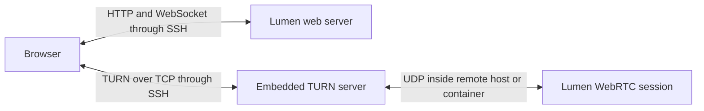

# SSH port forwarding

Lumen can carry signaling, video, audio, and input through an SSH connection. The browser uses TURN over TCP, with UDP confined to the remote host or container. No UDP ports need to be reachable from the client.

## Run on the remote host

Add these options to your normal Lumen command:

```sh
lumen --ssh --bind-addr 127.0.0.1:8080 --ssh-turn-port 13478
```

Keep your usual authentication and desktop launch settings. `--ssh` does not disable authentication or change the HTTP bind address; the command above explicitly binds HTTP to loopback.

On the client:

```sh
ssh -N -o ExitOnForwardFailure=yes \
  -L 127.0.0.1:8080:127.0.0.1:8080 \
  -L 127.0.0.1:13478:127.0.0.1:3478 \
  user@remote-host
```

Open `http://127.0.0.1:8080`. Both forwards are necessary. HTTP and WebSocket signaling use 8080; all WebRTC traffic uses the TURN forward on 13478.

If you omit `--ssh-turn-port`, the browser uses the value of `--turn-port`, which defaults to 3478. Forward that same port locally in this case. Each viewer must use the advertised local TURN port.



## Settings

| Option | Environment variable | Behavior |
| --- | --- | --- |
| `--ssh` | `LUMEN_SSH=true` | Enable TURN/TCP, advertise client loopback, and restrict the browser to relay candidates. Default off. |
| `--ssh-turn-port` | `LUMEN_SSH_TURN_PORT` | Client-side forwarded TURN port. Defaults to `--turn-port`; requires SSH mode. |
| `--turn-tcp` | `LUMEN_TURN_TCP=true` | Enable TCP alongside UDP and advertise TCP to browsers without SSH mode. Implied by `--ssh`. |
| `--turn-bind-ip` | `LUMEN_TURN_BIND_IP` | Listener and relay socket bind IP. Defaults to `127.0.0.1` in SSH mode, otherwise `0.0.0.0`. IPv4 only. |
| `--turn-port` | `LUMEN_TURN_PORT` | Remote TURN listener port, UDP and optionally TCP. Default 3478. Zero disables TURN and is incompatible with SSH/TCP mode. |
| `--turn-external-ip` | `LUMEN_TURN_EXTERNAL_IP` | Remote relay address. Defaults to `127.0.0.1` in SSH mode; otherwise uses route discovery. IPv4 only. |

The browser-facing TURN URL and the remote relay address are distinct. In the example, the browser receives `turn:127.0.0.1:13478?transport=tcp`. The relay allocations use addresses on the remote machine. Do not set the relay address to the client machine's IP.

SSH mode binds the WebRTC session's local UDP socket to loopback and skips its public-route discovery probe. The embedded UDP TURN listener remains available for Lumen's internal TURN client. ICE relay candidates still describe UDP allocations; TCP is the transport between the browser and TURN, not between TURN and its peer.

## Containers

When SSH runs on the container host, bind Lumen's listeners to the container interfaces and publish only TCP on host loopback:

```sh
podman run --rm \
  -p 127.0.0.1:8080:8080/tcp \
  -p 127.0.0.1:3478:3478/tcp \
  -e LUMEN_SSH=true \
  -e LUMEN_SSH_TURN_PORT=13478 \
  -e LUMEN_TURN_BIND_IP=0.0.0.0 \
  -e LUMEN_BIND=0.0.0.0:8080 \
  ghcr.io/swedishborgie/lumen:latest-labwc
```

Use an image built with SSH support and add the usual graphics devices, authentication settings, and volumes for your deployment. TURN and Lumen share the container's network namespace, so the UDP listener and relay range do not need publishing in this mode. Use the same SSH command shown above.

## Validation and troubleshooting

Run the automated tests:

```sh
cargo test --workspace
node --test tests/ice-config.test.mjs
```

The TURN tests cover TCP stream framing, padding, invalid/truncated messages, authenticated allocation, bidirectional relay traffic over TCP and UDP, concurrent clients, and disconnect/shutdown cleanup. A session regression test checks that successful and failed SDP negotiation both release the internal relay port. The JavaScript tests cover the forwarded URL, credentials, relay-only policy, and invalid configuration.

For deployment acceptance, connect from a separate machine with direct UDP to the remote host blocked. Verify video, audio, keyboard, pointer, clipboard, resize, multiple viewers, and reconnection after restarting SSH. Leave a session open for more than ten minutes to exercise allocation and permission refresh. Repeat with software encoding and a GPU-enabled deployment, and with Chrome and Firefox.

Inspect the selected candidate pair in browser WebRTC diagnostics. The browser's local candidate should have type `relay` and `relayProtocol` of `tcp` where the browser exposes that statistic. The candidate's `protocol` can still say `udp`. Capture the client-to-host network traffic to confirm it uses only SSH for Lumen.

If the page loads but WebRTC fails, check the second SSH forward, the advertised local TURN port, and whether the remote TURN TCP listener is reachable from sshd. `/api/config` must return a TCP TURN URL and `iceTransportPolicy: "relay"`. Configuration failures now stop connection setup rather than falling back to public STUN.

Firefox may suppress ICE gathering for the loopback TURN endpoint. In the Firefox 135 test build, connecting required opening `about:config` and setting `media.peerconnection.ice.loopback` to `true` on the client. Without it, ICE gathering remained pending with no relay candidate. Chromium 134 gathered the candidate with its default settings.

TCP packet loss can delay video, audio, and input until retransmission completes. SSH multiplexes both forwards onto its transport. Reduce bitrate if the tunnel accumulates latency.

The embedded TCP adapter currently limits TURN messages to 1,500 bytes to match the underlying `turn` library's receive buffer. It supports up to 128 simultaneous TCP connections, closes stalled writes after ten seconds, and closes connections with no complete incoming message for ten minutes. Normal TURN refresh requests keep idle allocations alive. TLS is not provided by this listener; SSH protects the TCP connection across the network.
