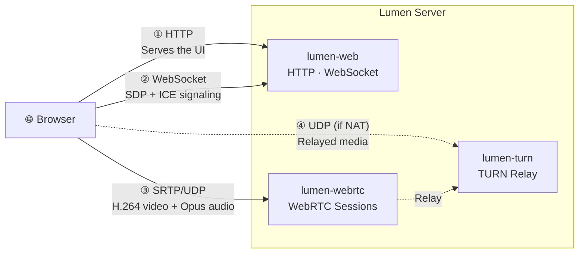
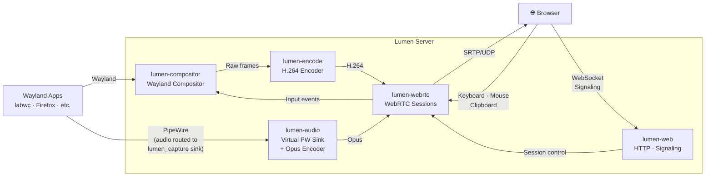
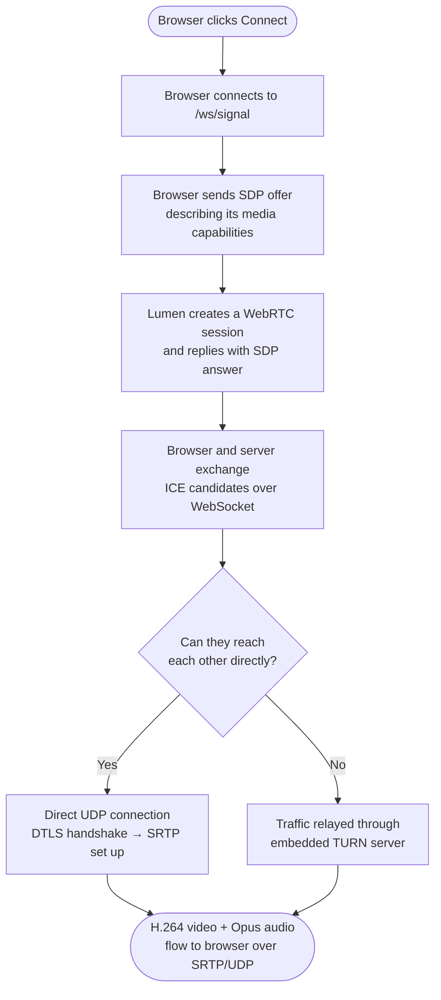
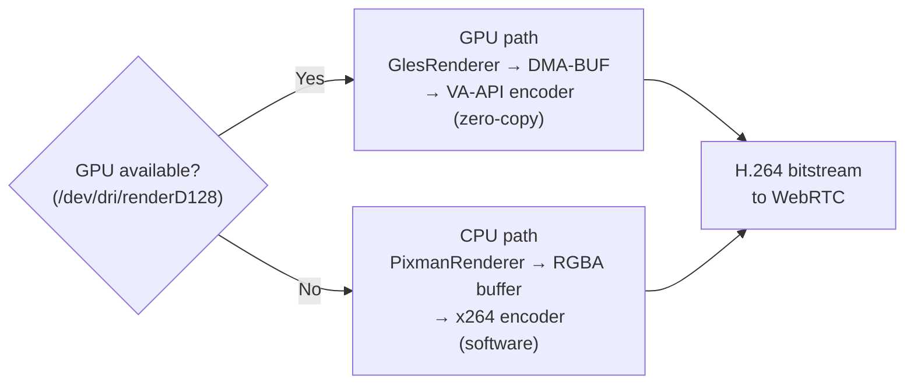

# Architecture
{: .no_toc }

  
On this page

  {: .text-delta }
- TOC
{:toc}

---

## Browser ↔ Server Overview

A browser connects to Lumen using two distinct connections:

1. **WebSocket** (TCP) — used during setup to negotiate the WebRTC connection (signaling).
2. **WebRTC** (UDP) — once connected, all media and input flow over encrypted UDP.

The embedded TURN server acts as a relay so the stream works across NAT without any external infrastructure.

---

## Internal Pipeline

Inside the server, data flows in two directions simultaneously — video and audio travel from the server to the browser, while input events travel from the browser back to the compositor.

---

## How a Connection Is Established

When a browser clicks **Connect**, it goes through a short signaling handshake before media starts flowing:

Once the SRTP connection is established, the WebSocket is no longer in the media path — all video, audio, and input flow directly over UDP.

---

## Components at a Glance

| Component | Role |
|-----------|------|
| **lumen-compositor** | Wayland compositor built on [Smithay](https://github.com/Smithay/smithay). Runs Wayland apps, captures frames, and injects input events. |
| **lumen-encode** | H.264 encoder. Uses VA-API (GPU, zero-copy) when available; falls back to x264 (software) automatically. |
| **lumen-audio** | Creates a virtual PipeWire audio sink (`lumen_capture`); captures audio routed to it and encodes it to Opus. |
| **lumen-webrtc** | Manages WebRTC sessions via [str0m](https://github.com/algesten/str0m). Handles ICE, DTLS, SRTP, and RTP packetization. |
| **lumen-web** | Axum HTTP server that serves the browser client and handles WebSocket signaling. |
| **lumen-turn** | Embedded TURN/STUN relay. Ensures streams work across NAT without an external relay service. |
| **lumen-gamepad** | Creates virtual input devices via `uinput` so browser gamepads appear as standard Linux input devices. |
| **web/** | Vanilla JavaScript browser client. Handles WebRTC setup, video rendering, and input capture. |

---

## Rendering Paths

Lumen automatically selects a rendering path based on whether a GPU render node is available:

The GPU path avoids any CPU memory copy and is strongly preferred. The CPU path works on any machine but uses significantly more CPU resources.
