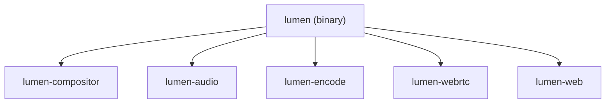
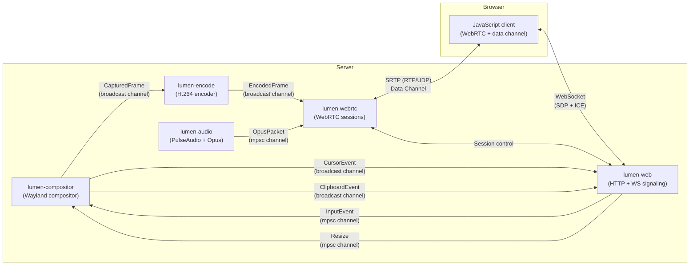
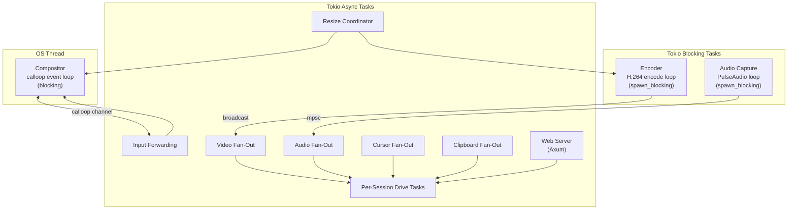
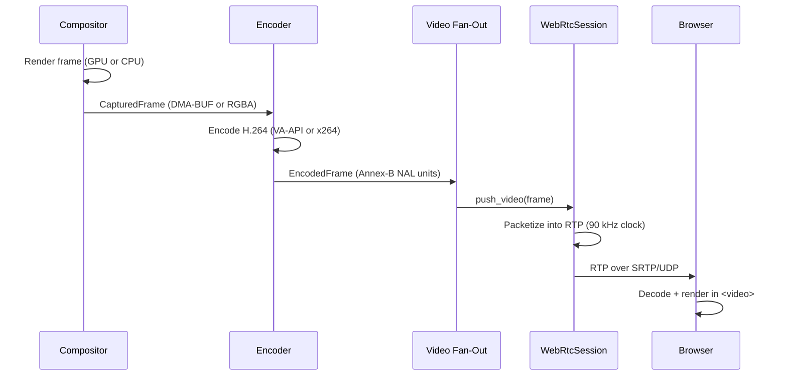
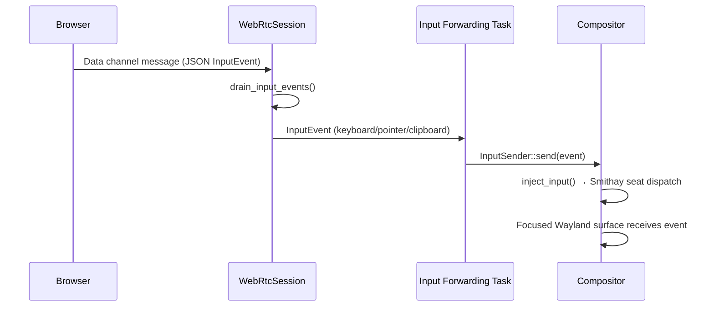
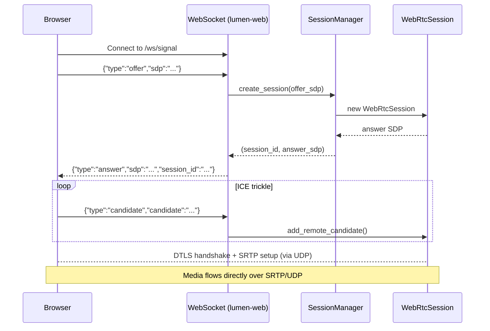
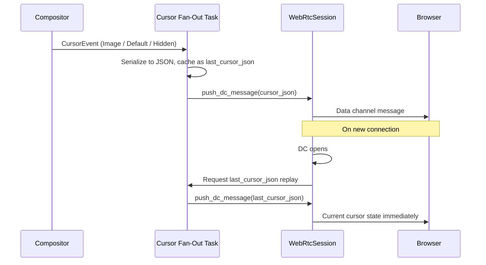
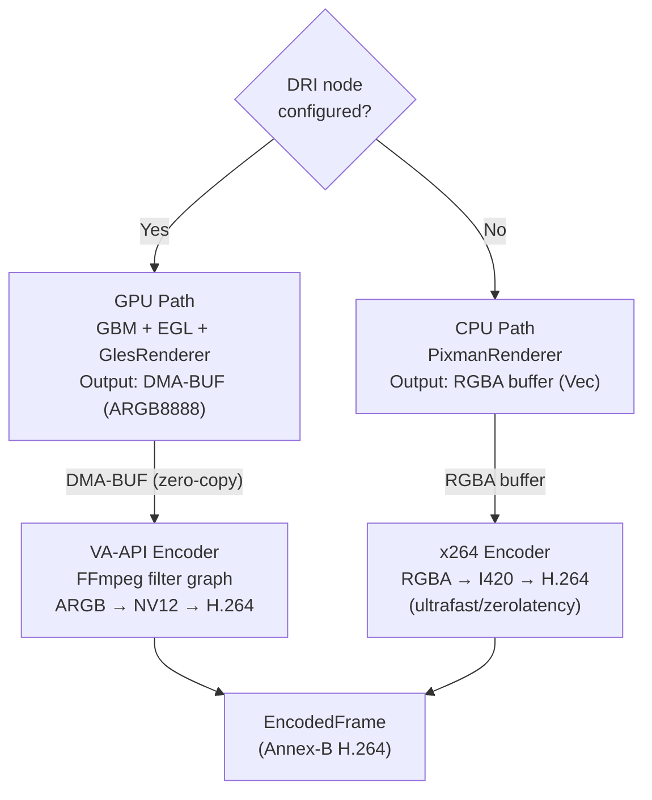

# Lumen — Architecture

This document describes the overall system architecture of Lumen: how its components are structured, how they communicate, and how data flows from the compositor to the browser.

## Crate Dependency Graph

Lumen is organized as a Cargo workspace. The main binary depends on all five specialized crates; the crates themselves are intentionally decoupled from one another.

## Component Overview

## Threading and Execution Model

Different parts of the system require different concurrency models. The compositor and encoders are blocking and live on dedicated threads; networking and coordination are async.

## Full Data Flow

### Video Path (Compositor → Browser)

### Input Path (Browser → Compositor)

### WebRTC Signaling (Browser ↔ Server)

### Cursor Synchronization

## Communication Channels Summary

| Channel | Type | Producer | Consumer(s) | Payload |
|---------|------|----------|-------------|---------|
| Captured frames | `tokio::broadcast` | Compositor | Encoder | `CapturedFrame` |
| Encoded frames | `tokio::broadcast` | Encoder | Video fan-out | `EncodedFrame` |
| Audio packets | `tokio::mpsc` | Audio capture | Audio fan-out | `OpusPacket` |
| Cursor events | `tokio::broadcast` | Compositor | Cursor fan-out | `CursorEvent` |
| Clipboard events | `tokio::broadcast` | Compositor | Clipboard fan-out | `ClipboardEvent` |
| Input events | `tokio::mpsc` | Web/WebRTC drive tasks | Input forwarding task | `InputEvent` |
| Resize | `tokio::mpsc` | Web server | Resize coordinator | `(u32, u32)` |
| Compositor commands | `calloop::channel` | Async tasks | Compositor thread | `InputEvent`, resize |

## Key Protocols

| Protocol | Layer | Purpose |
|---------|-------|---------|
| **Wayland** | IPC (Unix socket) | Window manager ↔ application communication |
| **WebSocket** | TCP/HTTP upgrade | SDP offer/answer and ICE candidate exchange |
| **ICE** | UDP | NAT traversal and peer connectivity establishment |
| **DTLS** | UDP | Key exchange for SRTP |
| **SRTP** | UDP | Encrypted RTP media transport |
| **RTP** (H.264, RFC 6184) | SRTP | Video frame packetization and delivery |
| **RTP** (Opus, RFC 7587) | SRTP | Audio packet delivery |
| **WebRTC Data Channel** | SCTP over DTLS | Input events, cursor updates, clipboard sync |

## Rendering Paths

Lumen supports two rendering paths depending on whether a DRI render node is configured:

The GPU path avoids any CPU memory copy: the compositor renders into a GPU-allocated DMA-BUF, the FFmpeg filter graph maps that buffer directly into the VA-API encoder pipeline, and H.264 NAL units come out the other side.
