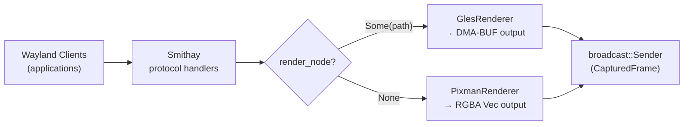

# lumen-compositor

**Crate**: `crates/lumen-compositor`

The compositor is the heart of Lumen. It creates and manages a Wayland server, renders connected client applications, captures frames for encoding, and injects input events from the browser back into the session.

## Responsibilities

- Start and run a Wayland compositor using [Smithay](https://github.com/Smithay/smithay)
- Manage Wayland protocol state (surfaces, seats, outputs, popups, layer shell)
- Render connected applications to an offscreen target (GPU or CPU)
- Capture rendered frames and emit them for downstream encoding
- Inject keyboard, pointer, and scroll events into the Wayland seat
- Capture and broadcast cursor image changes and clipboard state
- Support dynamic output resolution changes at runtime

## Public API

### `Compositor`

The main entry point. Constructed with a `CompositorConfig`, runs its event loop on the calling thread (blocking).

```rust
pub struct Compositor { ... }

impl Compositor {
    pub fn new(config: CompositorConfig) -> Result<Self>;
    pub fn run(&mut self) -> Result<()>;              // Blocking calloop event loop
    pub fn input_sender(&self) -> InputSender;
    pub fn frame_receiver(&self) -> broadcast::Receiver<CapturedFrame>;
    pub fn cursor_receiver(&self) -> broadcast::Receiver<CursorEvent>;
    pub fn clipboard_receiver(&self) -> broadcast::Receiver<ClipboardEvent>;
}
```

### `InputSender`

A cheaply cloneable handle for sending input and control commands to the compositor from async tasks.

```rust
pub struct InputSender { ... }  // Clone

impl InputSender {
    pub fn send(&self, event: InputEvent);
    pub fn resize(&self, width: u32, height: u32);
    pub fn clipboard_write(&self, text: String);
}
```

### Key Types

```rust
pub struct CompositorConfig {
    pub width: u32,
    pub height: u32,
    pub scale: f64,
    pub target_fps: f64,
    pub render_node: Option<PathBuf>,  // DRI device path; None = CPU rendering
}

pub struct CapturedFrame {
    pub rgba_buffer: Option<Bytes>,    // CPU path: raw RGBA8888 bytes
    pub dmabuf: Option<Dmabuf>,        // GPU path: zero-copy DMA-BUF handle
    pub drm_modifier: u64,
    pub width: u32,
    pub height: u32,
    pub pts_ms: u64,                   // Presentation timestamp (milliseconds)
}

pub enum InputEvent {
    KeyboardKey  { scancode: u32, state: u32 },   // state: 0=release, 1=press
    PointerMotion { x: f64, y: f64 },
    PointerButton { btn: u32, state: u32 },       // BTN_LEFT=0x110, etc.
    PointerAxis   { x: f64, y: f64 },             // Scroll delta
    ClipboardWrite { text: String },
}

pub enum CursorEvent {
    Default,
    Hidden,
    Image { width: u32, height: u32, hotspot_x: u32, hotspot_y: u32, rgba: Bytes },
}

pub enum ClipboardEvent {
    Text(String),
    Cleared,
}
```

## Internal Structure

### `AppState`

The internal Smithay application state. Holds all Wayland protocol state, renderer handles, input devices, and window/space management. Implements all required Smithay delegate traits.

### `render_and_capture(state, damage_tracker)`

The main per-frame function called from the calloop timer:

1. Collects Wayland surfaces into render elements
2. Renders to the offscreen target via the active renderer
3. Reads back the frame (or provides the DMA-BUF handle)
4. Broadcasts a `CapturedFrame` on the channel
5. Sends Wayland frame callbacks to all client surfaces

### `inject_input(state, event)`

Translates an `InputEvent` from the browser into Smithay seat events:

- Determines the currently focused surface
- For keyboard events: converts the browser scancode to an XKB keycode (adds +8 offset to bridge the Linux evdev and XKB keycode spaces)
- Dispatches to the Smithay `Seat` (keyboard / pointer)

## Rendering Paths

### GPU Path (DRI node provided)

Activated when `CompositorConfig::render_node` is `Some(path)`.

- Creates a GBM device and EGL context on the given DRI node
- `GlesRenderer` renders into an offscreen DMA-BUF allocated in `Argb8888` format
- `CapturedFrame` carries `dmabuf: Some(...)`, `rgba_buffer: None`
- The downstream VA-API encoder consumes the DMA-BUF directly — no CPU copy

### CPU Path (no DRI node)

- `PixmanRenderer` renders into a `Vec<u8>` RGBA buffer
- `CapturedFrame` carries `rgba_buffer: Some(...)`, `dmabuf: None`
- The downstream x264 software encoder receives the RGBA data



## Wayland Protocols Supported

| Protocol | Purpose |
|---------|---------|
| `wl_compositor`, `wl_surface` | Core surface management |
| `wl_seat`, `wl_keyboard`, `wl_pointer` | Input device seat |
| `xdg_shell` | Toplevel windows and popups |
| `xdg_output` | Output geometry reporting |
| `wlr_layer_shell` | Layer-surface (panels, overlays) |
| `wl_data_device` | Clipboard (copy/paste) |
| `zwp_linux_dmabuf` | DMA-BUF buffer import/export |
| `xdg_decoration` | Server-side window decorations |

## Design Notes

- **Dedicated OS thread**: The compositor runs its calloop event loop on its own thread, isolated from the Tokio async runtime. This avoids blocking the async runtime with potentially long rendering operations.
- **Broadcast channels**: `CapturedFrame`, `CursorEvent`, and `ClipboardEvent` are published on `tokio::broadcast` channels so multiple consumers (encoder, statistics, etc.) can subscribe without coordination.
- **calloop channel bridge**: The async world sends `InputEvent`s to the compositor via a `calloop` channel, which integrates cleanly with the compositor's event loop without polling.
- **Damage tracking**: Only changed screen regions are re-rendered each frame, reducing GPU workload.
- **Scancode offset**: Linux evdev scancodes and XKB keycodes differ by 8. The compositor adds this offset when forwarding keyboard events so Wayland clients receive correctly-mapped keys.
