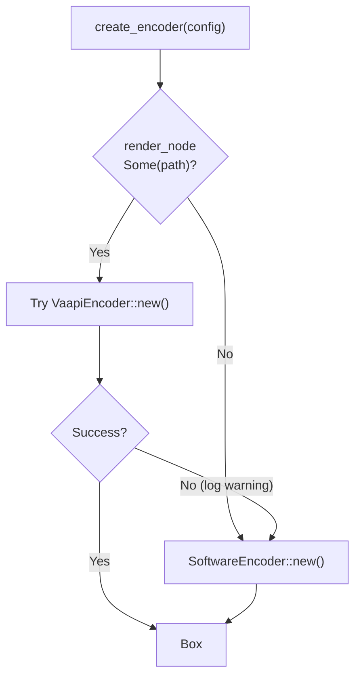
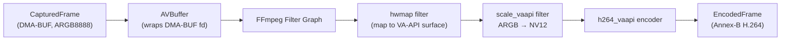

# lumen-encode

**Crate**: `crates/lumen-encode`

`lumen-encode` abstracts over hardware (VA-API) and software (x264) H.264 video encoders behind a common trait. It receives `CapturedFrame`s from the compositor and produces `EncodedFrame`s (Annex-B H.264 NAL units) for WebRTC packetization.

## Responsibilities

- Provide a `VideoEncoder` trait that the rest of the system depends on
- Implement a hardware encoder backend using FFmpeg + VA-API (Intel/AMD GPUs)
- Implement a software encoder backend using libx264
- Auto-select the best available backend, falling back gracefully
- Support runtime keyframe requests, bitrate updates, and output resolution changes
- Perform RGBA → I420 color space conversion for the software path

## Public API

### `VideoEncoder` Trait

```rust
pub trait VideoEncoder: Send {
    fn encode(&mut self, frame: CapturedFrame) -> Result<Option<EncodedFrame>>;
    fn request_keyframe(&mut self);
    fn update_bitrate(&mut self, kbps: u32);
    fn resize(&mut self, width: u32, height: u32) -> Result<()>;
}
```

### `EncodedFrame`

```rust
pub struct EncodedFrame {
    pub data: Bytes,       // H.264 Annex-B NAL units (0x00 0x00 0x00 0x01 start codes)
    pub pts_ms: u64,       // Presentation timestamp (milliseconds)
    pub is_keyframe: bool, // True if this frame contains an IDR NAL unit
}
```

Output is always in **Annex-B** format with 4-byte start codes (`0x00 0x00 0x00 0x01`), which maps directly to the RTP H.264 packetization format (RFC 6184) used by `lumen-webrtc`.

### `EncoderConfig`

```rust
pub struct EncoderConfig {
    pub width: u32,
    pub height: u32,
    pub fps: f64,
    pub bitrate_kbps: u32,
    pub crf: i32,                      // CRF quality (0–51); used when cbr = false
    pub cbr: bool,                     // Constant bitrate mode
    pub render_node: Option<PathBuf>,  // DRI device for VA-API; None = software only
}
```

### Factory Function

```rust
pub fn create_encoder(config: EncoderConfig) -> Result<Box<dyn VideoEncoder>>
```

Attempts to initialize the VA-API encoder when `render_node` is provided. If that fails (driver not available, unsupported GPU, etc.) it falls back to the x264 software encoder. If no `render_node` is given, the software encoder is used directly.



## Backend: `VaapiEncoder` (Hardware)

**File**: `src/vaapi.rs`

Uses **FFmpeg libavcodec** via the `ffmpeg-sys-next` FFI crate.

### Zero-Copy GPU Pipeline



The compositor DMA-BUF handle is wrapped into an `AVBuffer` and fed into an FFmpeg filter graph. The `hwmap` filter maps it onto a VA-API hardware surface; `scale_vaapi` converts the pixel format from ARGB8888 to NV12 (required by the VA-API H.264 encoder); `h264_vaapi` performs the final hardware encode. No CPU memory copy occurs in this path.

### Initialization
- Creates a DRM device context from the configured DRI node
- Builds a VA-API hardware device context wrapping the DRM context
- Constructs the filter graph: `buffer → hwmap → scale_vaapi → buffersink`
- Initializes `h264_vaapi` codec context with the configured resolution, bitrate, and framerate

## Backend: `SoftwareEncoder` (x264)

**File**: `src/software.rs`

Uses **libx264** via the `x264-sys` FFI crate.

### Configuration

| Parameter | Value | Rationale |
|-----------|-------|-----------|
| Preset | `ultrafast` | Minimize encode latency for real-time streaming |
| Tune | `zerolatency` | Disable B-frames and lookahead; optimize for WebRTC |
| Profile | `baseline` | Broadest browser compatibility |
| Threads | `1` | Deterministic, single-threaded encode |
| Annex-B | enabled | Direct RTP packetization compatibility |
| Repeat headers | enabled | SPS/PPS prepended to every IDR frame |
| RC mode | CBR (ABR) or CRF | Selectable via `EncoderConfig::cbr` |

### Encode Steps
1. Receive `CapturedFrame` with `rgba_buffer`
2. Convert RGBA8888 → I420 (YUV 4:2:0) via `yuv.rs`
3. Submit I420 planes to x264
4. Return `EncodedFrame` with Annex-B NAL units

## Supporting Modules

### `yuv.rs` — Color Space Conversion

RGBA8888 to I420 (planar YUV 4:2:0) conversion used by the software encoder. Each pixel's luma (Y) and chroma (U/V) values are calculated from the RGB channels and written into separate planes.

### `packetize.rs` — NAL Unit Utilities

- `split_annex_b()` — Parse individual NAL units from an Annex-B bitstream
- `contains_idr()` — Check whether a NAL unit with type 5 (IDR slice) is present, used to set `EncodedFrame::is_keyframe`

## Design Notes

- **Annex-B output**: Both encoders produce Annex-B format, which `lumen-webrtc` packetizes directly into RTP without format conversion.
- **Keyframe on demand**: The web server sets a `keyframe_flag: Arc<AtomicBool>` which the encoder loop checks before each frame. This allows the WebRTC layer to force an IDR frame when a new peer connects or a resize occurs.
- **Peer count optimization**: An `Arc<AtomicUsize>` tracks the number of connected WebRTC peers. The encoder skips encoding entirely when this counter is zero, saving CPU/GPU when no one is watching.
- **Resize**: Both encoders support `resize()`, which reinitializes internal state for the new resolution. A keyframe is always forced immediately after a resize.
