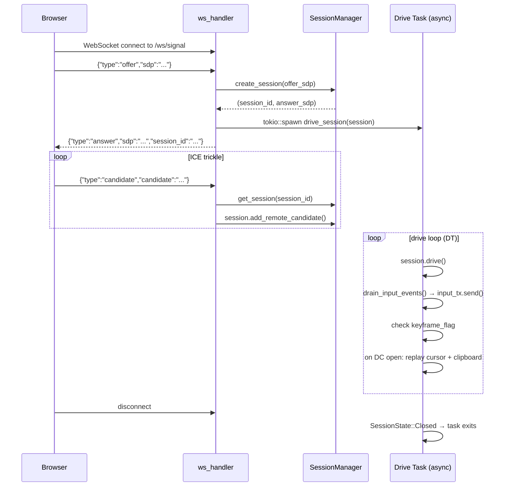
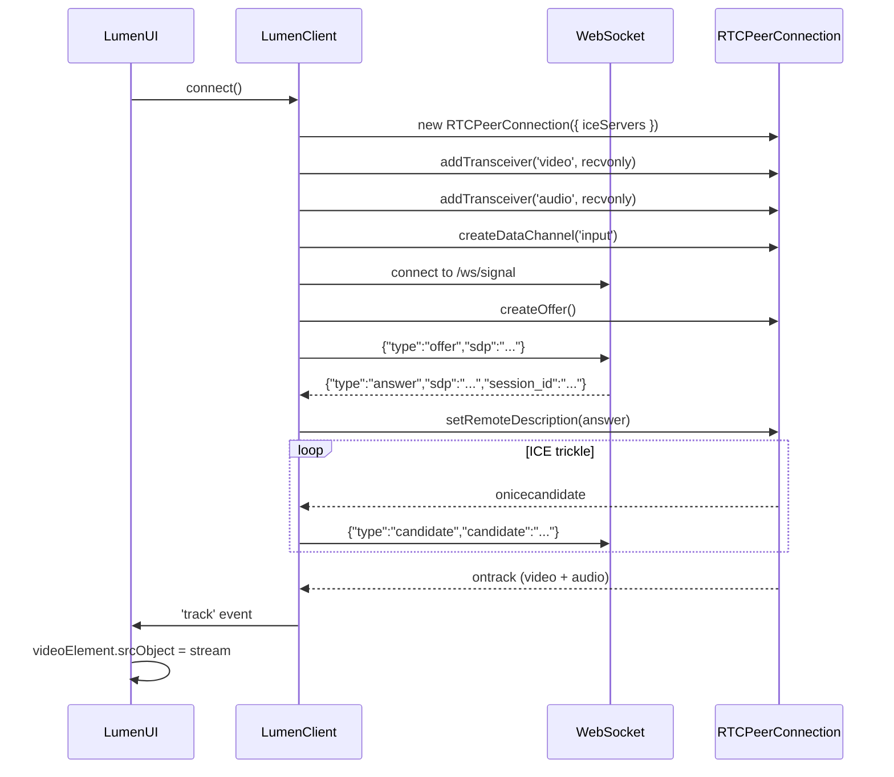

# lumen-web

**Crate**: `crates/lumen-web`

`lumen-web` is the HTTP and WebSocket server. It serves the browser client assets, handles WebRTC signaling, routes input events, and coordinates the browser-facing side of media flow.

## Responsibilities

- Serve the static browser client (HTML, JS, CSS) over HTTP
- Accept WebSocket connections for WebRTC signaling
- Broker SDP offer/answer exchange and ICE candidate trickle
- Spawn and manage per-session drive tasks
- Forward input events from the browser to the compositor
- Relay resize requests from the browser to the resize coordinator
- Cache the latest cursor and clipboard state for replaying to new connections

## Public API

### `WebServer`

```rust
pub struct WebServer { ... }

impl WebServer {
    pub fn new(config: WebServerConfig) -> Self;
    pub async fn run(self) -> Result<()>;  // Starts the Axum HTTP server
}
```

### `WebServerConfig`

```rust
pub struct WebServerConfig {
    pub bind_addr: SocketAddr,
    pub static_dir: PathBuf,
    pub session_manager: Arc<SessionManager>,
    pub input_tx: mpsc::Sender<InputEvent>,              // → compositor input forwarding task
    pub keyframe_flag: Arc<AtomicBool>,                  // → encoder: force keyframe
    pub last_cursor_json: Arc<Mutex<Option<Vec<u8>>>>,   // cached cursor state
    pub last_clipboard_json: Arc<Mutex<Option<Vec<u8>>>>, // cached clipboard state
    pub resize_tx: mpsc::Sender<(u32, u32)>,             // → resize coordinator task
}
```

## HTTP Routes

| Route | Handler | Description |
|-------|---------|-------------|
| `GET /ws/signal` | `ws_handler` | WebSocket upgrade for WebRTC signaling |
| `GET /*` | Static file server | Serves files from `static_dir` |

CORS and request tracing middleware are applied to all routes via `tower-http`.

## WebSocket Signaling Protocol

### Client → Server

```json
{ "type": "offer",     "sdp": "<SDP string>" }
{ "type": "candidate", "candidate": "<candidate string>", "sdp_mid": "0", "sdp_m_line_index": 0 }
{ "type": "resize",    "width": 1920, "height": 1080 }
```

### Server → Client

```json
{ "type": "answer",  "sdp": "<SDP string>", "session_id": "<uuid>" }
{ "type": "error",   "message": "<reason>" }
```

## Signaling Flow



## Per-Session Drive Task

When a session is created, a Tokio task is spawned to drive it:

1. Calls `session.drive()` in a tight loop
2. **Input events**: Calls `drain_input_events()` and sends each event on `input_tx` to the input forwarding task. `ClipboardWrite` events are handled specially (forwarded to compositor clipboard state).
3. **Keyframe requests**: If the session's data channel signals a keyframe is needed (e.g., after resize), sets `keyframe_flag = true`.
4. **State replay**: When the data channel first opens, reads `last_cursor_json` and `last_clipboard_json` and pushes them to the session's data channel so the new peer immediately has the current state.
5. Exits when `drive()` returns `SessionState::Closed`.

## Resize Handling

Resize requests from the browser are validated before forwarding:
- Width and height must be positive
- Both dimensions must be even (required by H.264)
- Neither dimension may exceed 4096

On a valid resize, the new dimensions are sent to the resize coordinator task, which coordinates the compositor output resize and encoder reinitialization, then forces a keyframe.

## Browser Client

The browser client lives in `web/` at the repository root.

### Files

| File | Purpose |
|------|---------|
| `index.html` | Entry point; video element, Connect/Disconnect buttons, clipboard panel, statistics display |
| `lumen-client.js` | `LumenClient` — all WebRTC logic |
| `lumen-ui.js` | `LumenUI` — UI controller, wires client events to DOM |
| `style.css` | Page styling |

### `LumenClient` API

```javascript
class LumenClient extends EventTarget {
    async connect(signalUrl?)  // Connect to the server (default: ws://<host>/ws/signal)
    disconnect()               // Close the WebRTC connection

    get stream()               // MediaStream containing video and audio tracks
    get state()                // 'idle' | 'connecting' | 'connected' | 'disconnected'
}
// Events: 'statuschange' { detail: string }
//         'statechange'  { detail: state }
//         'track'        { detail: MediaStreamTrack }
```

### Connection Sequence (JavaScript)



### Input Encoding (JavaScript)

Keyboard, mouse, and scroll events are captured from the video element and sent as JSON over the data channel:

| Browser Event | Data Channel Message |
|--------------|---------------------|
| `keydown` / `keyup` | `{ type: "keyboard_key", scancode: <evdev>, state: 1/0 }` |
| `mousemove` | `{ type: "pointer_motion", x: <f64>, y: <f64> }` |
| `mousedown` / `mouseup` | `{ type: "pointer_button", btn: <linux_btn>, state: 1/0 }` |
| `wheel` | `{ type: "pointer_axis", x: <delta>, y: <delta> }` |

Mouse buttons are mapped to Linux `BTN_*` codes (BTN_LEFT=272, BTN_RIGHT=273, BTN_MIDDLE=274). Keyboard keys are mapped via a static `KEY_MAP` table from DOM key names to Linux evdev scancodes.

### Clipboard Panel

The sidebar contains a shared clipboard textarea that acts as a two-way bridge between the browser and the compositor:

- **Compositor → browser**: When the compositor emits a `clipboard_update` message (e.g., the user copies text inside a remote application), the text is written into the textarea. The user can then copy it locally.
- **Browser → compositor**: Any change to the textarea (typing or pasting) is debounced 300 ms and sent as a `clipboard_write` data channel message. The compositor sets its Wayland selection to the received text, making it immediately available for pasting in remote applications.

A deduplication check in the compositor prevents the clipboard from echoing back to the browser after a `clipboard_write`, avoiding feedback loops. The textarea is also pre-populated on new connections via the `last_clipboard_json` state-replay mechanism.

## Technology Stack

| Library | Purpose |
|---------|---------|
| `axum` 0.8 | Async HTTP/WebSocket framework |
| `tower-http` 0.6 | Middleware: static file serving, CORS, request tracing |
| `tokio` | Async runtime |
