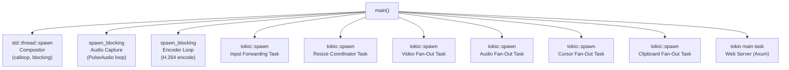
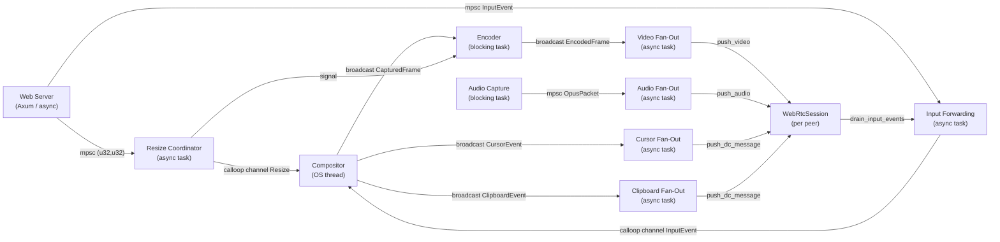
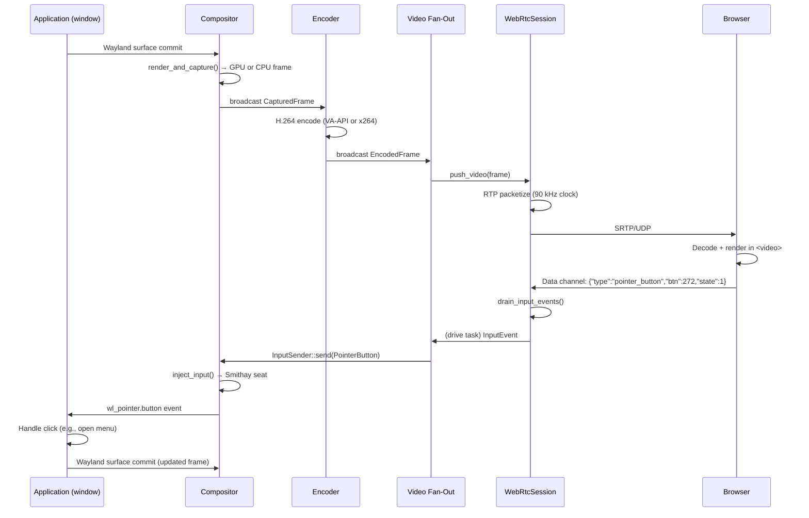

# Main Application

**File**: `src/main.rs`

The main binary is the orchestration layer for Lumen. It parses configuration, initializes all subsystems, wires them together with channels, spawns tasks on the appropriate executors, and runs until shutdown.

## Responsibilities

- Parse CLI arguments and environment variables via `clap`
- Initialize logging/tracing
- Construct all subsystem configs and instances
- Spawn the compositor on a dedicated OS thread
- Spawn the audio capture as a blocking Tokio task
- Spawn the encoder as a blocking Tokio task
- Spawn coordination tasks (input forwarding, resize, fan-out)
- Start the Axum web server as the Tokio main task

## CLI Configuration

All options accept both a `--flag` and a `LUMEN_*` environment variable.

| Flag | Env Var | Default | Description |
|------|---------|---------|-------------|
| `--bind-addr` | `LUMEN_BIND` | `0.0.0.0:8080` | HTTP bind address |
| `--width` | `LUMEN_WIDTH` | `1920` | Display width |
| `--height` | `LUMEN_HEIGHT` | `1080` | Display height |
| `--fps` | `LUMEN_FPS` | `30.0` | Target frame rate |
| `--video-bitrate-kbps` | `LUMEN_VIDEO_BITRATE_KBPS` | `4000` | Video bitrate |
| `--audio-device` | `LUMEN_AUDIO_DEVICE` | *(auto)* | PulseAudio device name |
| `--dri-node` | `LUMEN_DRI_NODE` | *(none)* | GPU render node path |
| `--inner-display` | `LUMEN_INNER_DISPLAY` | *(none)* | Inner Wayland display for clipboard bridging |
| `--ice-servers` | `LUMEN_ICE_SERVERS` | `stun:stun.l.google.com:19302` | Comma-separated ICE server URLs |
| `--static-dir` | `LUMEN_STATIC_DIR` | `./web` | Static file directory |
| `--auth` | `LUMEN_AUTH` | `none` | Authentication mode: `none`, `basic`, or `oauth2` |
| `--auth-oauth2-issuer-url` | `LUMEN_AUTH_OAUTH2_ISSUER_URL` | *(required for oauth2)* | OIDC issuer URL |
| `--auth-oauth2-client-id` | `LUMEN_AUTH_OAUTH2_CLIENT_ID` | *(required for oauth2)* | OAuth2 client ID |
| `--auth-oauth2-client-secret` | `LUMEN_AUTH_OAUTH2_CLIENT_SECRET` | *(required for oauth2)* | OAuth2 client secret |
| `--auth-oauth2-redirect-uri` | `LUMEN_AUTH_OAUTH2_REDIRECT_URI` | *(required for oauth2)* | Full callback URL, e.g. `http://localhost:8080/auth/callback` |
| `--auth-oauth2-subject` | `LUMEN_AUTH_OAUTH2_SUBJECT` | *(required for oauth2)* | Expected `sub` claim in the ID token |

## Task Spawn Model



## Channel Wiring

The following channels connect the tasks. All channels are created in `main()` before any task is spawned, so every task receives its channel ends at construction time.



## Task Descriptions

### Compositor (OS thread)

```rust
std::thread::spawn(|| compositor.run())
```

Runs the Smithay calloop event loop. Emits frames, cursor events, and clipboard events on broadcast channels. Receives `InputEvent`s and resize commands via calloop channels.

### Audio Capture (blocking task)

```rust
tokio::task::spawn_blocking(|| audio_capture.run())
```

Runs the PulseAudio capture loop. Sends `OpusPacket`s on an mpsc channel to the audio fan-out task.

### Encoder (blocking task)

```rust
tokio::task::spawn_blocking(|| encoder_loop(...))
```

Receives `CapturedFrame`s from the compositor broadcast channel. Encodes each frame (skipping when peer count is zero). Checks `keyframe_flag` before each encode. Sends `EncodedFrame`s on a broadcast channel to the video fan-out task.

### Input Forwarding Task

```rust
tokio::spawn(async { input_forwarding_loop(...) })
```

Receives `InputEvent`s from the web server's mpsc channel. Forwards them to the compositor via `InputSender`. `ClipboardWrite` events are handled separately to update the compositor's clipboard state.

### Resize Coordinator Task

```rust
tokio::spawn(async { resize_loop(...) })
```

Receives resize requests `(width, height)` from the web server. Sends the resize command to the compositor via `InputSender::resize()`. Signals the encoder to reinitialize for the new dimensions. Forces a keyframe immediately after resize.

### Video Fan-Out Task

```rust
tokio::spawn(async { video_fan_out_loop(...) })
```

Receives `EncodedFrame`s from the encoder broadcast channel. On each frame, locks the session list from `SessionManager::all_sessions()` and calls `session.push_video(frame)` for every active peer.

### Audio Fan-Out Task

```rust
tokio::spawn(async { audio_fan_out_loop(...) })
```

Receives `OpusPacket`s from the audio capture mpsc channel. Distributes to all active WebRTC sessions via `session.push_audio(packet)`.

### Cursor Fan-Out Task

```rust
tokio::spawn(async { cursor_fan_out_loop(...) })
```

Receives `CursorEvent`s from the compositor broadcast channel. Serializes each event to JSON. Updates `last_cursor_json` (shared state for new-connection replay). Broadcasts the JSON to all sessions via `SessionManager::broadcast_dc_message()`.

### Clipboard Fan-Out Task

```rust
tokio::spawn(async { clipboard_fan_out_loop(...) })
```

Same pattern as cursor fan-out, but for `ClipboardEvent`s. Updates `last_clipboard_json` and broadcasts to all peers.

### Web Server (main async task)

```rust
web_server.run().await
```

The Axum server runs on the Tokio main task. It serves static files and handles WebSocket connections. For each new WebSocket connection, it spawns a per-session drive task (see [lumen-web](./lumen-web.md)).

## Complete Data Flow Walkthrough

The following traces a single rendered frame all the way to the browser and a click event back:



## Shared State (Arc-wrapped)

| Value | Type | Shared Between |
|-------|------|----------------|
| Session manager | `Arc<SessionManager>` | Web server, fan-out tasks |
| Peer count | `Arc<AtomicUsize>` | Encoder loop, session manager |
| Keyframe flag | `Arc<AtomicBool>` | Encoder loop, web server/drive tasks |
| Last cursor JSON | `Arc<Mutex<Option<Vec<u8>>>>` | Cursor fan-out, per-session drive tasks |
| Last clipboard JSON | `Arc<Mutex<Option<Vec<u8>>>>` | Clipboard fan-out, per-session drive tasks |
